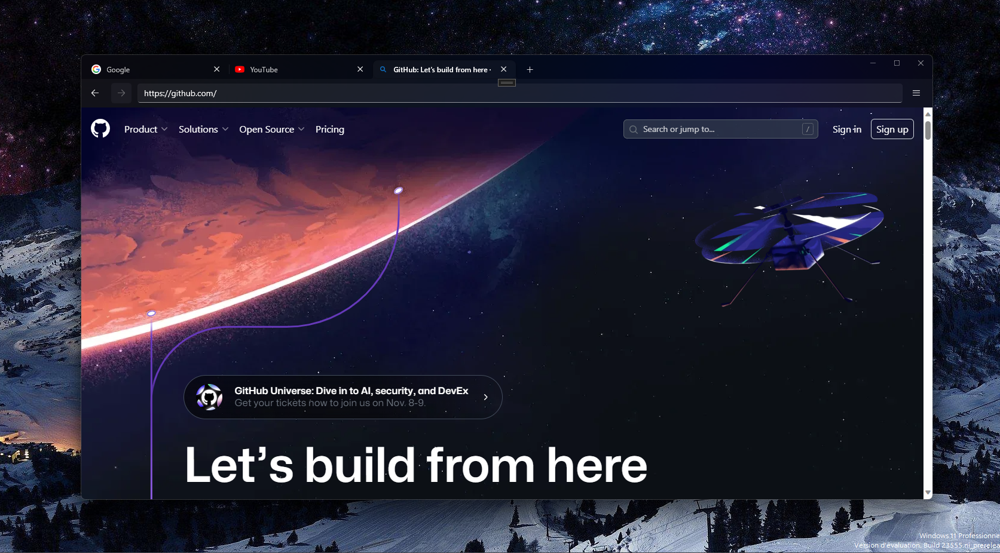

# SipaaApps
SipaaApps is an open-source package of apps only for your needs.

# Browse
Browse is a web browser with a consistent UI built on top of Microsoft's WebView2

## Screenshot

## FAQ
### Where i can download it?
You need to compile the source code.

Required:
* Visual Studio 2022 with .NET workflow & the WinUI 3 project option enabled.
* Windows Developer Mode enabled

### Why it doesn't have an icon?
I didn't make an icon